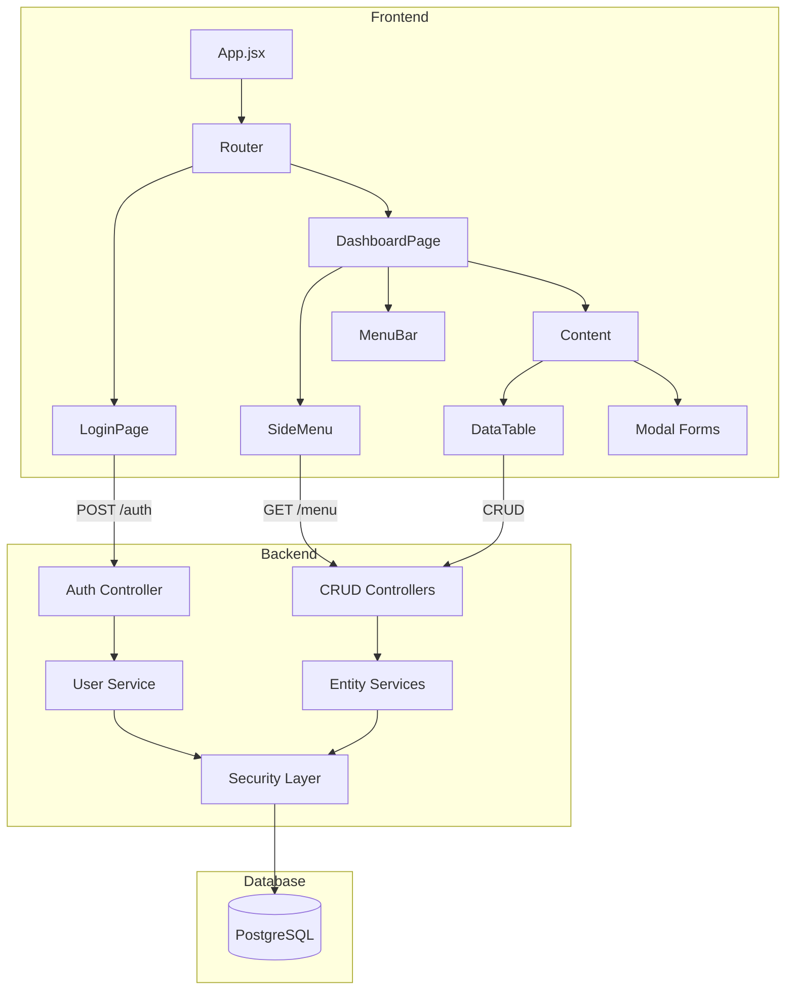

# Arquitectura del Sistema

## Visión General

ResiManager sigue una arquitectura de tres capas con separación clara de responsabilidades:

```
┌─────────────────────────────────────────────────────────────┐
│                      FRONTEND (SPA)                         │
│         React 19 + Vite + AdminLTE 3                        │
│         Deploy: Vercel                                      │
└─────────────────────────┬───────────────────────────────────┘
                          │ HTTP/REST
                          ▼
┌─────────────────────────────────────────────────────────────┐
│                      BACKEND (API)                          │
│         Spring Boot 3 + Java 17                             │
│         Spring Security + JWT                               │
│         Deploy: Docker                                      │
└─────────────────────────┬───────────────────────────────────┘
                          │ JDBC
                          ▼
┌─────────────────────────────────────────────────────────────┐
│                      DATABASE                               │
│         PostgreSQL 15+                                      │
│         Flyway (Migraciones)                                │
└─────────────────────────────────────────────────────────────┘
```

## Stack Tecnológico

### Frontend - `resimanager-spa/`

| Tecnología | Versión | Propósito |
|------------|---------|-----------|
| React | 19.2.3 | Framework UI |
| Vite | 5.4.1 | Build tool |
| React Router | 7.3.0 | Navegación SPA |
| FontAwesome | 6.6.0 | Iconografía |
| jQuery | 3.7.1 | Compatibilidad AdminLTE |
| ESLint | 9.9.0 | Linting |

### Backend - `resimanager-backoffice/`

| Tecnología | Versión | Propósito |
|------------|---------|-----------|
| Java | 17+ | Lenguaje principal |
| Spring Boot | 3.x | Framework backend |
| Spring Security | - | Autenticación/Autorización |
| Maven | - | Gestión de dependencias |
| Flyway | - | Migraciones DB |
| Swagger/OpenAPI | - | Documentación API |

### Base de Datos

| Tecnología | Propósito |
|------------|-----------|
| PostgreSQL | Motor de base de datos principal |
| Flyway | Control de versiones de esquema |

## Estructura de Proyectos

### Frontend

```
resimanager-spa/
├── public/
├── src/
│   ├── components/
│   │   ├── breadcrumb/
│   │   │   └── Breadcrumb.jsx
│   │   ├── content/
│   │   │   └── Content.jsx
│   │   ├── login/
│   │   │   └── Login.jsx
│   │   └── menu/
│   │       ├── MenuBar.jsx
│   │       └── SideMenu.jsx
│   ├── hooks/
│   │   ├── useMenuData.jsx
│   │   └── Menu.json
│   ├── pages/
│   │   ├── DashboardPage.jsx
│   │   └── LoginPage.jsx
│   ├── App.jsx
│   └── main.jsx
├── package.json
├── vite.config.js
└── vercel.json
```

### Backend

```
resimanager-backoffice/
├── src/
│   ├── main/
│   │   ├── java/com/
│   │   │   └── [paquetes Spring Boot]
│   │   └── resources/
│   │       ├── application.yml
│   │       ├── application-local.yml
│   │       ├── application-dev.yml
│   │       ├── application-test.yml
│   │       └── migrations/
│   │           └── [scripts Flyway]
│   └── test/
├── Dockerfile
├── pom.xml
└── README.md
```

## Diagrama de Componentes



## Configuración de Entornos

### Perfiles Spring Boot

| Perfil | Uso | Configuración |
|--------|-----|---------------|
| `local` | Desarrollo local | `application-local.yml` |
| `dev` | Servidor desarrollo | `application-dev.yml` |
| `test` | Testing/QA | `application-test.yml` |

### Variables de Entorno

```properties
# Base de datos
DB_HOST=localhost
DB_PORT=5432
DB_NAME=resimanager
DB_USERNAME=postgres
DB_PASSWORD=password

# Servidor
SERVER_PORT=8080
```

## Comunicación Frontend-Backend

### Autenticación

```
1. Usuario ingresa credenciales
2. Frontend envía POST /auth/login
3. Backend valida contra tabla Persona
4. Backend genera JWT
5. Frontend almacena token
6. Requestes subsecuentes incluyen Authorization: Bearer <token>
```

### Carga de Menú Dinámico

```
1. Usuario selecciona contexto (Administradora/Conjunto/Perfil)
2. Frontend envía GET /menu con contexto
3. Backend consulta permisos según perfil
4. Backend retorna estructura de menú filtrada
5. Frontend renderiza SideMenu
```

## Despliegue

### Frontend (Vercel)

```bash
# Build de producción
npm run build

# Deploy automático desde rama main
```

### Backend (Docker)

```bash
# Construir imagen
docker build -t resimanager-backoffice .

# Ejecutar contenedor
docker run -p 8080:8080 resimanager-backoffice
```

### URLs por Entorno

| Entorno | Frontend | Backend | Swagger |
|---------|----------|---------|---------|
| Local | localhost:5173 | localhost:8080 | /swagger-ui.html |
| Dev | dev.resimanager.com | api-dev.resimanager.com | /swagger-ui.html |
| Prod | resimanager.com | api.resimanager.com | - |
