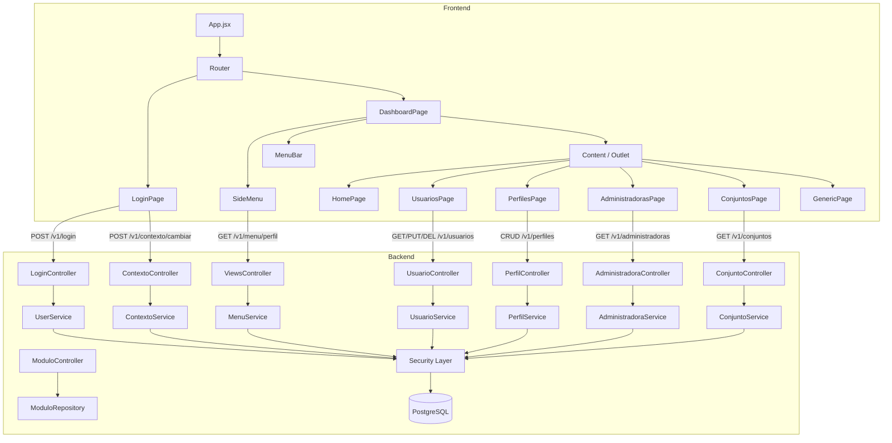

# Arquitectura del Sistema

## Visión General

ResiManager sigue una arquitectura de tres capas con separación clara de responsabilidades:

```
┌─────────────────────────────────────────────────────────────┐
│                      FRONTEND (SPA)                         │
│         React 19 + Vite + AdminLTE 3                        │
│         Deploy: Vercel                                      │
└─────────────────────────┬───────────────────────────────────┘
                          │ HTTP/REST
                          ▼
┌─────────────────────────────────────────────────────────────┐
│                      BACKEND (API)                          │
│         Spring Boot 3.1.4 + Java 21                         │
│         Spring Security + JWT (HttpOnly Cookie)             │
│         Deploy: Koyeb                                       │
└─────────────────────────┬───────────────────────────────────┘
                          │ JDBC
                          ▼
┌─────────────────────────────────────────────────────────────┐
│                      DATABASE                               │
│         PostgreSQL 15+                                      │
│         Flyway (Migraciones)                                │
└─────────────────────────────────────────────────────────────┘
```

## Stack Tecnológico

### Frontend - `resimanager-spa/`

| Tecnología | Versión | Propósito |
|------------|---------|-----------|
| React | 19.2.3 | Framework UI |
| Vite | 5.4.1 | Build tool |
| React Router | 7.3.0 | Navegación SPA |
| FontAwesome | 6.6.0 | Iconografía |
| jQuery | 3.7.1 | Compatibilidad AdminLTE |
| ESLint | 9.9.0 | Linting |

### Backend - `resimanager-backoffice/`

| Tecnología | Versión | Propósito |
|------------|---------|-----------|
| Java | 21 | Lenguaje principal |
| Spring Boot | 3.1.4 | Framework backend |
| Spring Security | 6.x | Autenticación/Autorización (JWT + Cookie HttpOnly) |
| Maven | 3.8+ | Gestión de dependencias |
| Flyway | 9.0.0 | Migraciones DB |
| SpringDoc OpenAPI | 2.3.0 | Documentación API (Swagger) |
| JJWT | 0.12.6 | Generación y validación de JWT |
| PostgreSQL | 15+ | Motor de base de datos |
| H2 | 2.3.232 | Base de datos embebida para testing |
| Lombok | 1.18.30 | Reducción de boilerplate |
| Caffeine | - | Cache para rate limiting

### Base de Datos

| Tecnología | Propósito |
|------------|-----------|
| PostgreSQL | Motor de base de datos principal |
| Flyway | Control de versiones de esquema |

## Estructura de Proyectos

### Frontend

```
resimanager-spa/
├── public/
├── src/
│   ├── components/
│   │   ├── breadcrumb/
│   │   │   └── Breadcrumb.jsx
│   │   ├── common/
│   │   │   ├── DataTable.jsx
│   │   │   ├── PageLayout.jsx
│   │   │   └── Toast.jsx
│   │   ├── content/
│   │   │   └── Content.jsx
│   │   ├── examples/
│   │   │   └── FormExample.jsx
│   │   ├── forms/
│   │   │   ├── FormInput.jsx
│   │   │   ├── FormCheckbox.jsx
│   │   │   ├── FormRadio.jsx
│   │   │   ├── FormSelect.jsx
│   │   │   └── FormTextarea.jsx
│   │   ├── login/
│   │   │   ├── Login.jsx
│   │   │   └── ContextSelector.jsx
│   │   └── menu/
│   │       ├── MenuBar.jsx
│   │       └── SideMenu.jsx
│   ├── context/
│   │   └── AuthContext.jsx
│   ├── hooks/
│   │   ├── useMenuData.jsx
│   │   └── Menu.json
│   ├── pages/
│   │   ├── AdministradorasPage.jsx
│   │   ├── ConjuntosPage.jsx
│   │   ├── ContextSelectorPage.jsx
│   │   ├── DashboardPage.jsx
│   │   ├── FormShowcase.jsx
│   │   ├── GenericPage.jsx
│   │   ├── HomePage.jsx
│   │   ├── LoginPage.jsx
│   │   ├── PropertiesPage.jsx
│   │   ├── UsuarioFormPage.jsx
│   │   ├── UsuariosPage.jsx
│   │   ├── asignaciones/
│   │   │   ├── AdministradoraUsuariosPage.jsx
│   │   │   ├── AsignarPerfilesPage.jsx
│   │   │   ├── ConjuntoUsuariosPage.jsx
│   │   │   └── UsuarioPerfilesPage.jsx
│   │   └── perfiles/
│   │       ├── PerfilDetailPage.jsx
│   │       ├── PerfilFormPage.jsx
│   │       └── PerfilesPage.jsx
│   ├── services/
│   │   └── api.js
│   ├── App.jsx
│   └── main.jsx
├── package.json
├── vite.config.js
└── vercel.json
```

### Backend

```
resimanager-backoffice/
├── src/
│   ├── main/
│   │   ├── java/com/resimanager/backoffice/
│   │   │   ├── config/
│   │   │   │   ├── cache/
│   │   │   │   ├── cors/
│   │   │   │   ├── openapi/
│   │   │   │   └── security/
│   │   │   │       ├── jwt/
│   │   │   │       └── provider/
│   │   │   ├── controller/
│   │   │   │   └── handler/
│   │   │   ├── dto/
│   │   │   ├── exception/
│   │   │   ├── persistance/
│   │   │   │   ├── entity/
│   │   │   │   └── repository/
│   │   │   ├── service/
│   │   │   │   └── mapper/
│   │   │   └── utils/
│   │   └── resources/
│   │       ├── application.yml
│   │       ├── application-local.yml
│   │       └── migrations/
│   │           ├── V2.0.0__DROP_OLD_TABLES.sql
│   │           ├── V2.0.1__CREATE_CORE_TABLES.sql
│   │           ├── V2.0.2__CREATE_SECURITY_TABLES.sql
│   │           ├── V2.0.3__CREATE_RELATIONSHIP_TABLES.sql
│   │           ├── V2.0.4__CREATE_INVITATION_TABLES.sql
│   │           ├── V2.0.5__INSERT_BASE_DATA.sql
│   │           ├── V2.0.6__INSERT_TEST_DATA.sql
│   │           ├── V2.0.7__ASSIGN_ADMIN_CONTEXT.sql
│   │           └── V2.0.8__ASSIGN_PROFILE_PERMISSIONS.sql
│   └── test/                          # Pendiente
├── .env.example
├── Dockerfile
├── pom.xml
└── README.md
```

## Diagrama de Componentes



## Configuración de Entornos

### Perfiles Spring Boot

| Perfil | Uso | Configuración |
|--------|-----|---------------|
| `local` | Desarrollo local | `application-local.yml` (H2 embebida) |
| `dev` | Desarrollo con BD externa | `application.yml` (PostgreSQL vía .env) |

### Variables de Entorno

```properties
# Base de datos
DB_HOST=localhost
DB_PORT=5432
DB_NAME=resimanager
DB_USERNAME=postgres
DB_PASSWORD=password

# Servidor
SERVER_PORT=8080
```

## Comunicación Frontend-Backend

### Autenticación

```
1. Usuario ingresa credenciales
2. Frontend envía POST /v1/login (password en Base64)
3. Backend valida contra tabla Persona (BCrypt)
4. Backend genera JWT y lo establece como cookie HttpOnly
5. Frontend almacena solo datos de usuario/contexto en localStorage
6. Requests subsecuentes envían cookie automáticamente
7. Backend también acepta header Authorization: Bearer (backward compatible)
```

### Carga de Menú Dinámico

```
1. Usuario selecciona contexto (Administradora/Conjunto/Perfil)
2. Frontend envía GET /menu con contexto
3. Backend consulta permisos según perfil
4. Backend retorna estructura de menú filtrada
5. Frontend renderiza SideMenu
```

## Despliegue

### Frontend (Vercel)

```bash
# Build de producción
npm run build

# Deploy automático desde rama main
```

### Backend (Koyeb)

Despliegue en Koyeb desde el repositorio de GitHub:
- URL: https://chilly-libbey-wtysoftware-aab36281.koyeb.app

### URLs por Entorno

| Entorno | Frontend | Backend | Swagger |
|---------|----------|---------|---------|
| Local | localhost:5000 | localhost:8080 | /swagger-ui.html |
| Koyeb (dev) | Vercel | chilly-libbey-...koyeb.app | /swagger-ui.html |
| Prod | TBD | TBD | TBD |
