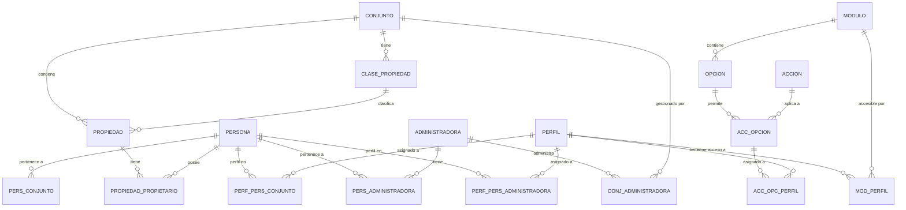

# Modelo de Datos

## Convenciones de Nomenclatura

### Reglas Generales

| Regla | Ejemplo | Descripción |
|-------|---------|-------------|
| Nombres en singular | `persona`, `conjunto` | No usar plurales |
| Prefijos cortos para columnas | `per`, `conj`, `adm` | Identifican la tabla |
| Snake_case | `per_nombre`, `adm_rif` | Separación con guión bajo |
| Sin acentos en columnas | `per_direccion` | Caracteres ASCII |

### Prefijos de Tabla

| Prefijo | Tabla | Descripción |
|---------|-------|-------------|
| `per` | persona | Datos de personas |
| `adm` | administradora | Empresas administradoras |
| `conj` | conjunto | Conjuntos residenciales |
| `prf` | perfil | Perfiles de acceso |
| `mit` | menu_item | Items del menú |
| `mod` | modulo | Módulos del sistema |
| `opc` | opcion | Opciones de módulo |
| `acc` | accion | Acciones disponibles |
| `invi` | invitacion | Invitaciones al sistema |
| `prop` | propiedad | Unidades inmobiliarias |
| `claprop` | clase_propiedad | Tipos de propiedad |

### Campos de Auditoría

Casi todas las tablas incluyen:

```sql
sts       VARCHAR(1)   -- Estatus: 'A' Activo, 'I' Inactivo, 'V' Vencido
fch_crea  TIMESTAMP    -- Fecha de creación
fch_mod   TIMESTAMP    -- Fecha de última modificación
usr_crea  INTEGER      -- ID del usuario que creó
usr_mod   INTEGER      -- ID del usuario que modificó
```

## Entidades Principales

### Diagrama Entidad-Relación



### Tabla: persona

Datos de usuarios naturales o jurídicos del sistema.

```sql
CREATE TABLE persona (
    per_id          SERIAL PRIMARY KEY,
    per_documento   VARCHAR(20) NOT NULL,      -- Cédula/RIF/Pasaporte
    per_tipo_doc    VARCHAR(3) NOT NULL,       -- V, E, J, P
    per_nombre      VARCHAR(100) NOT NULL,
    per_apellido    VARCHAR(100),
    per_usuario     VARCHAR(50) UNIQUE,        -- Login
    per_clave       VARCHAR(255),              -- Hash SHA-256/512
    per_email       VARCHAR(150),
    per_telefono    VARCHAR(20),
    per_direccion   VARCHAR(255),
    per_sts         VARCHAR(1) DEFAULT 'A',    -- A: Activo, I: Inactivo
    per_usr_nivel   VARCHAR(1),                -- Nivel de usuario
    per_fch_crea    TIMESTAMP DEFAULT NOW(),
    per_fch_mod     TIMESTAMP,
    per_usr_crea    INTEGER,
    per_usr_mod     INTEGER
);
```

### Tabla: administradora

Empresas que administran conjuntos residenciales.

```sql
CREATE TABLE administradora (
    adm_id          SERIAL PRIMARY KEY,
    adm_documento   VARCHAR(20) NOT NULL,      -- RIF de la empresa
    adm_nombre      VARCHAR(150) NOT NULL,
    adm_direccion   VARCHAR(255),
    adm_telefono    VARCHAR(20),
    adm_email       VARCHAR(150),
    adm_sts         VARCHAR(1) DEFAULT 'A',
    adm_fch_crea    TIMESTAMP DEFAULT NOW(),
    adm_fch_mod     TIMESTAMP
);
```

### Tabla: conjunto

Agrupaciones físicas: residenciales, edificios, centros comerciales.

```sql
CREATE TABLE conjunto (
    conj_id         SERIAL PRIMARY KEY,
    conj_documento  VARCHAR(20) NOT NULL,      -- RIF del conjunto
    conj_nombre     VARCHAR(150) NOT NULL,
    conj_direccion  VARCHAR(255),
    conj_tipo       VARCHAR(10),               -- R: Residencial, C: Comercial, M: Mixto
    conj_sts        VARCHAR(1) DEFAULT 'A',
    conj_fch_crea   TIMESTAMP DEFAULT NOW(),
    conj_fch_mod    TIMESTAMP
);
```

### Tabla: propiedad

Unidades individuales dentro de un conjunto.

```sql
CREATE TABLE propiedad (
    prop_id         SERIAL PRIMARY KEY,
    prop_conj_id    INTEGER NOT NULL REFERENCES conjunto(conj_id),
    prop_clase_id   INTEGER REFERENCES clase_propiedad(claprop_id),
    prop_codigo     VARCHAR(20) NOT NULL,      -- Número/Apartamento
    prop_piso       VARCHAR(5),
    prop_mt2        DECIMAL(10,2),
    prop_sts        VARCHAR(1) DEFAULT 'A',
    prop_fch_crea   TIMESTAMP DEFAULT NOW(),
    
    CONSTRAINT uk_propiedad UNIQUE (prop_conj_id, prop_codigo)
);
```

### Tabla: perfil

Perfiles de acceso al sistema.

```sql
CREATE TABLE perfil (
    prf_id          SERIAL PRIMARY KEY,
    prf_nombre      VARCHAR(50) NOT NULL,
    prf_descripcion VARCHAR(255),
    prf_sts         VARCHAR(1) DEFAULT 'A',
    prf_fch_crea    TIMESTAMP DEFAULT NOW()
);
```

## Tablas de Relación

### Persona-Administradora

```sql
CREATE TABLE pers_administradora (
    pa_id           SERIAL PRIMARY KEY,
    pa_per_id       INTEGER NOT NULL REFERENCES persona(per_id),
    pa_adm_id       INTEGER NOT NULL REFERENCES administradora(adm_id),
    pa_sts          VARCHAR(1) DEFAULT 'A',
    pa_fch_crea     TIMESTAMP DEFAULT NOW(),
    
    CONSTRAINT uk_pers_adm UNIQUE (pa_per_id, pa_adm_id)
);
```

### Conjunto-Administradora (con contrato)

```sql
CREATE TABLE conj_administradora (
    ca_id           SERIAL PRIMARY KEY,
    ca_conj_id      INTEGER NOT NULL REFERENCES conjunto(conj_id),
    ca_adm_id       INTEGER NOT NULL REFERENCES administradora(adm_id),
    ca_sts          VARCHAR(1) DEFAULT 'A',
    ca_fch_crea     TIMESTAMP DEFAULT NOW()
);

-- Contrato entre administradora y conjunto
CREATE TABLE ctt_conj_administradora (
    cca_id          SERIAL PRIMARY KEY,
    cca_conj_id     INTEGER NOT NULL,
    cca_adm_id      INTEGER NOT NULL,
    cca_fch_hor_inicio    TIMESTAMP NOT NULL,
    cca_fch_hor_vencimiento TIMESTAMP NOT NULL,
    cca_sts         VARCHAR(1) DEFAULT 'A'
);
```

### Propiedad-Propietario

```sql
CREATE TABLE propietario_propiedad (
    pp_id           SERIAL PRIMARY KEY,
    pp_prop_id      INTEGER NOT NULL REFERENCES propiedad(prop_id),
    pp_per_id       INTEGER NOT NULL REFERENCES persona(per_id),
    pp_tipo         VARCHAR(1) DEFAULT 'P',    -- P: Propietario, A: Arrendatario
    pp_pct_participacion DECIMAL(5,2),         -- % de propiedad
    pp_sts          VARCHAR(1) DEFAULT 'A',
    pp_fch_crea     TIMESTAMP DEFAULT NOW(),
    pp_fch_desde    DATE,
    pp_fch_hasta    DATE
);
```

## Tablas de Seguridad

### Estructura de Permisos

```
┌─────────────┐     ┌─────────────┐     ┌─────────────┐
│   MODULO    │────<│   OPCION    │────<│   ACCION    │
│             │     │             │     │             │
│  Ej: Admin  │     │  Ej: Usuario│     │  INS/MOD/EL │
└─────────────┘     └─────────────┘     └─────────────┘
       │                   │                   │
       └───────────────────┴───────────────────┘
                           │
                           ▼
              ┌─────────────────────────┐
              │    ACC_OPCION           │
              │  (Acción sobre Opción)  │
              └─────────────────────────┘
                           │
                           ▼
              ┌─────────────────────────┐
              │    ACC_OPC_PERFIL       │
              │  (Asignada a Perfil)    │
              └─────────────────────────┘
```

### Tabla: menu_item

```sql
CREATE TABLE menu_item (
    mit_id          SERIAL PRIMARY KEY,
    mit_menu_id     INTEGER NOT NULL,          -- Menú al que pertenece
    mit_nombre      VARCHAR(50) NOT NULL,
    mit_tipo        VARCHAR(1) NOT NULL,       -- A: Agrupador, O: Opción, S: Separador
    mit_mod_id      INTEGER REFERENCES modulo(mod_id),
    mit_opc_id      INTEGER REFERENCES opcion(opc_id),
    mit_acc_id      INTEGER REFERENCES accion(acc_id),
    mit_item_padre  INTEGER REFERENCES menu_item(mit_id),
    mit_orden       INTEGER,
    mit_controlador VARCHAR(50),
    mit_metodo      VARCHAR(50),
    mit_sts         VARCHAR(1) DEFAULT 'A'
);
```

### Códigos de Acción

| Código | Nombre | Descripción |
|--------|--------|-------------|
| `MNJ` | Manejar | Control total (CRUD completo) |
| `INS` | Insertar | Crear nuevos registros |
| `MOD` | Modificar | Editar registros existentes |
| `VIS` | Visualizar | Solo lectura |
| `EL` | Eliminar | Borrar registros |

## Tablas de Invitación

### Tabla: invitacion

```sql
CREATE TABLE invitacion (
    invi_id             SERIAL PRIMARY KEY,
    invi_uuid           UUID NOT NULL UNIQUE,          -- Identificador único
    invi_email          VARCHAR(150) NOT NULL,
    invi_fch_hor_crea   TIMESTAMP DEFAULT NOW(),
    invi_fch_vencimiento TIMESTAMP NOT NULL,
    invi_sts            VARCHAR(1) DEFAULT 'A',        -- A: Activa, V: Vencida, U: Usada
    invi_per_id_crea    INTEGER REFERENCES persona(per_id)
);
```

### Tablas de Contexto de Invitación

```sql
-- Invitación para ámbito de Administradora
CREATE TABLE invi_administradora (
    ia_id           SERIAL PRIMARY KEY,
    ia_invi_id      INTEGER NOT NULL REFERENCES invitacion(invi_id),
    ia_adm_id       INTEGER NOT NULL REFERENCES administradora(adm_id)
);

-- Perfiles asignados en invitación de Administradora
CREATE TABLE perf_invi_administradora (
    pia_id          SERIAL PRIMARY KEY,
    pia_invi_id     INTEGER NOT NULL,
    pia_prf_id      INTEGER NOT NULL REFERENCES perfil(prf_id)
);

-- Conjuntos asignados en invitación de Administradora  
CREATE TABLE conj_invi_administradora (
    cia_id          SERIAL PRIMARY KEY,
    cia_invi_id     INTEGER NOT NULL,
    cia_conj_id     INTEGER NOT NULL REFERENCES conjunto(conj_id)
);

-- Invitación para ámbito de Conjunto
CREATE TABLE invi_conjunto (
    ic_id           SERIAL PRIMARY KEY,
    ic_invi_id      INTEGER NOT NULL REFERENCES invitacion(invi_id),
    ic_conj_id      INTEGER NOT NULL REFERENCES conjunto(conj_id)
);

-- Propiedades asignadas en invitación de Conjunto
CREATE TABLE ppd_invi_conjunto (
    ppic_id         SERIAL PRIMARY KEY,
    ppic_invi_id    INTEGER NOT NULL,
    ppic_prop_id    INTEGER NOT NULL REFERENCES propiedad(prop_id)
);
```

## Tablas de Catálogo

### Localización

```sql
CREATE TABLE pais (
    pais_id         SERIAL PRIMARY KEY,
    pais_nombre     VARCHAR(50) NOT NULL,
    pais_codigo     VARCHAR(3) UNIQUE
);

CREATE TABLE estado (
    est_id          SERIAL PRIMARY KEY,
    est_pais_id     INTEGER REFERENCES pais(pais_id),
    est_nombre      VARCHAR(50) NOT NULL
);

CREATE TABLE ciudad (
    ciud_id         SERIAL PRIMARY KEY,
    ciud_est_id     INTEGER REFERENCES estado(est_id),
    ciud_nombre     VARCHAR(50) NOT NULL
);
```

### Multimoneda

```sql
CREATE TABLE moneda (
    mon_id          SERIAL PRIMARY KEY,
    mon_codigo      VARCHAR(3) UNIQUE,          -- USD, VES, EUR
    mon_nombre      VARCHAR(50),
    mon_simbolo     VARCHAR(5),
    mon_sts         VARCHAR(1) DEFAULT 'A'
);

CREATE TABLE tasa_cambio (
    tc_id           SERIAL PRIMARY KEY,
    tc_mon_origen   INTEGER REFERENCES moneda(mon_id),
    tc_mon_destino  INTEGER REFERENCES moneda(mon_id),
    tc_valor        DECIMAL(15,6) NOT NULL,
    tc_fch_vigencia DATE NOT NULL,
    tc_sts          VARCHAR(1) DEFAULT 'A'
);
```

## Índices Recomendados

```sql
-- Búsqueda de persona por usuario
CREATE INDEX idx_persona_usuario ON persona(per_usuario);

-- Búsqueda de persona por email
CREATE INDEX idx_persona_email ON persona(per_email);

-- Invitaciones activas por UUID
CREATE INDEX idx_invitacion_uuid ON invitacion(invi_uuid);
CREATE INDEX idx_invitacion_sts ON invitacion(invi_sts);

-- Menú por perfil
CREATE INDEX idx_menu_item_menu ON menu_item(mit_menu_id);
CREATE INDEX idx_menu_item_padre ON menu_item(mit_item_padre);
```
