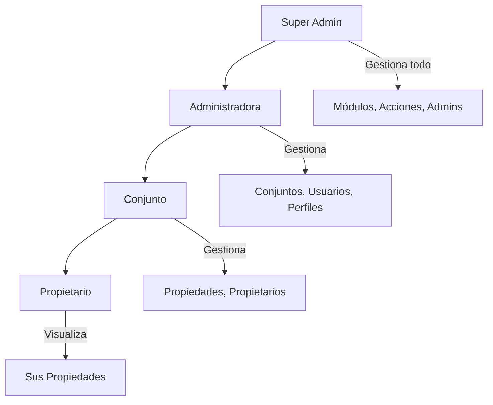
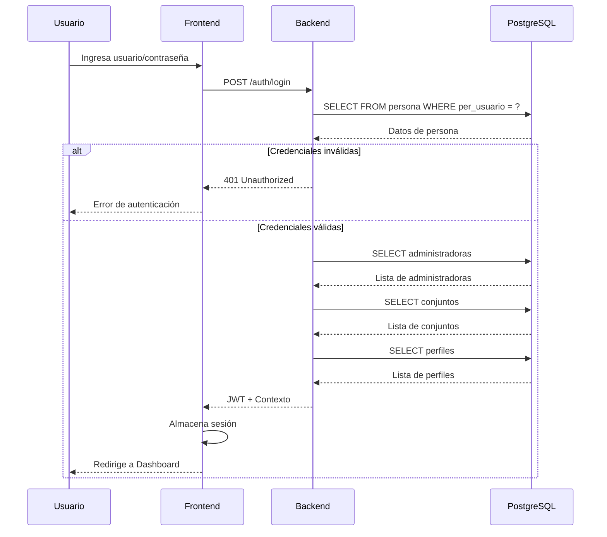
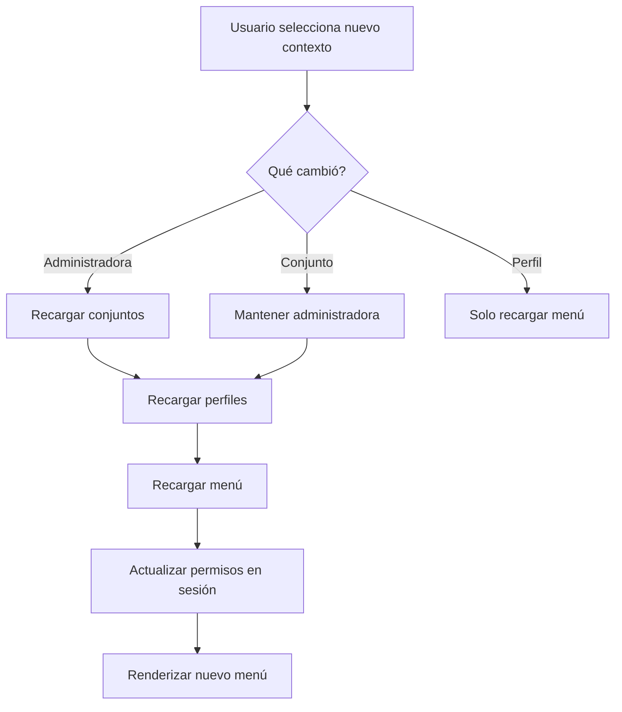

# Seguridad y Control de Acceso

## Modelo RBAC (Role-Based Access Control)

ResiManager implementa un sistema de control de acceso basado en roles con granularidad multinivel.

### Niveles de Jerarquía



## Roles del Sistema

### 1. Super Admin

**Nivel:** 0 (Máximo)

**Ámbito:** Global

**Permisos:**
| Módulo | Acciones |
|--------|----------|
| Módulos | MNJ |
| Acciones | MNJ |
| Administradoras | MNJ |
| Conjuntos | MNJ |
| Perfiles de acceso | MNJ |
| Usuarios | MNJ |

**Características:**
- Acceso a todas las administradoras
- Acceso a todos los conjuntos
- Puede crear y gestionar administradoras
- Configura módulos y acciones del sistema

### 2. Administradora

**Nivel:** 1

**Ámbito:** Administradora específica

**Permisos:**
| Módulo | Acciones |
|--------|----------|
| Administradora | VIS, MOD |
| Conjuntos | MNJ (solo asignados) |
| Perfiles de acceso | MNJ |
| Usuarios | MNJ |

**Características:**
- Gestiona conjuntos bajo contrato
- Crea usuarios para sus conjuntos
- Define perfiles de acceso
- Visualiza métricas de sus conjuntos

### 3. Conjunto

**Nivel:** 2

**Ámbito:** Conjunto específico

**Permisos:**
| Módulo | Acciones |
|--------|----------|
| Conjunto | VIS, MOD |
| Clase de propiedad | MNJ |
| Propiedades | MNJ |
| Propietarios | MNJ |
| Usuarios | MNJ |
| Perfiles de acceso | MNJ |

**Características:**
- Administra propiedades del conjunto
- Gestiona propietarios
- Crea usuarios del conjunto
- Define perfiles específicos

### 4. Propietario

**Nivel:** 3

**Ámbito:** Sus propiedades

**Permisos:**
| Módulo | Acciones |
|--------|----------|
| Propiedades | VIS |

**Características:**
- Solo visualiza sus propiedades
- Sin acceso a configuración
- Sin acceso a otros usuarios

## Estructura de Permisos

### Modelo Modular

```
┌─────────────────────────────────────────────────────┐
│                    PERFIL                           │
│              (ej: "Administrador Conjunto")         │
└─────────────────────┬───────────────────────────────┘
                      │ tiene
                      ▼
┌─────────────────────────────────────────────────────┐
│                 MOD_PERFIL                          │
│        (Módulos accesibles al perfil)               │
└─────────────────────┬───────────────────────────────┘
                      │ contiene
                      ▼
┌─────────────────────────────────────────────────────┐
│                  OPC_PERFIL                         │
│        (Opciones accesibles en el módulo)           │
└─────────────────────┬───────────────────────────────┘
                      │ permite
                      ▼
┌─────────────────────────────────────────────────────┐
│               ACC_OPC_PERFIL                        │
│     (Acciones específicas sobre cada opción)        │
│          INS | MOD | VIS | EL | MNJ                 │
└─────────────────────────────────────────────────────┘
```

### Consulta de Permisos

SQL para obtener opciones del menú según perfil:

```sql
SELECT 
    mit_nombre, 
    mit_tipo, 
    mit_item_padre, 
    mit_orden, 
    mit_controlador, 
    mit_metodo
FROM public.menu_item mi
JOIN public.acc_opc_perfil aop ON (
    aop_mod_id = mit_mod_id AND 
    aop_opc_id = mit_opc_id AND 
    aop_acc_id = mit_acc_id AND 
    aop_sts = 'A' AND 
    aop_prf_id = :perfil_id
)
JOIN public.opc_perfil op ON (
    op_mod_id = mit_mod_id AND
    op_opc_id = mit_opc_id AND
    op_sts = 'A' AND
    op_prf_id = :perfil_id
)
JOIN public.mod_perfil mp ON ( 
    mp_mod_id = mit_mod_id AND 
    mp_sts = 'A' AND
    mp_prf_id = :perfil_id
)
JOIN public.accion a ON (
    acc_id = mit_acc_id AND
    acc_sts = 'A'
)
JOIN public.modulo m ON (
    mod_id = mit_mod_id AND 
    mod_sts = 'A'
)
JOIN public.opcion o ON (
    opc_mod_id = mit_mod_id AND
    opcid = mit_opc_id AND
    opc_sts = 'A'
)
JOIN public.acc_opcion ao ON (
    ao_mod_id = mit_mod_id AND
    ao_opc_id = mit_opc_id AND
    ao_acc_id = mit_acc_id AND
    ao_sts = 'A'
)
WHERE mit_tipo = 'O' 
  AND mit_sts = 'A' 
  AND mit_menu_id = 1;
```

## Flujo de Inicio de Sesión

### Secuencia de Autenticación



### Validación de Cadena de Estatus

El sistema valida que toda la cadena de relaciones esté activa:

```sql
-- 1. Persona activa
SELECT per_id, per_nombre, per_clave, per_sts
FROM persona 
WHERE per_usuario = :usuario;

-- 2. Administradoras activas
SELECT adm_id, adm_nombre
FROM pers_administradora pa
JOIN administradora adm ON (adm_id = pa_adm_id AND adm_sts = 'A')
WHERE pa_per_id = :per_id AND pa_sts = 'A';

-- 3. Conjuntos activos (por administradora o directos)
SELECT DISTINCT conj_id, conj_nombre
FROM (
    SELECT conj_id, conj_nombre
    FROM conj_pers_administradora cpa
    JOIN conj_administradora ca ON (
        ca_adm_id = cpa_adm_id AND
        ca_conj_id = cpa_conj_id AND
        ca_sts = 'A'
    )
    JOIN conjunto c ON (conj_id = cpa_conj_id AND conj_sts = 'A')
    JOIN ctt_conj_administradora cca ON (
        cca_adm_id = cpa_adm_id AND
        cca_conj_id = cpa_conj_id AND
        cca_sts = 'A' AND
        NOW() BETWEEN cca_fch_hor_inicio AND cca_fch_hor_vencimiento
    )
    WHERE cpa_adm_id = :adm_id AND cpa_sts = 'A'
    
    UNION
    
    SELECT conj_id, conj_nombre
    FROM pers_conjunto pc
    JOIN conjunto c ON (conj_id = pc_conj_id AND conj_sts = 'A')
    WHERE pc_per_id = :per_id AND pc_sts = 'A'
) sq;

-- 4. Perfiles disponibles
SELECT DISTINCT prf_id, prf_nombre
FROM (
    SELECT prf_id, 'A- ' || prf_nombre as prf_nombre
    FROM perf_pers_administradora ppa
    JOIN perf_administradora pfa ON (
        pfa_adm_id = ppa_adm_id AND
        pfa_prf_id = ppa_prf_id AND
        pfa_sts = 'A'
    )
    JOIN perfil prf ON (prf_id = ppa_prf_id AND prf_sts = 'A')
    WHERE ppa_adm_id = :adm_id 
      AND ppa_per_id = :per_id 
      AND ppa_sts = 'A'
    
    UNION
    
    SELECT prf_id, 'C- ' || prf_nombre as prf_nombre
    FROM perf_pers_conjunto ppc
    JOIN perf_conjunto pfc ON (
        pfc_conj_id = ppc_conj_id AND
        pfc_prf_id = ppc_prf_id AND
        pfc_sts = 'A'
    )
    JOIN perfil prf ON (prf_id = ppc_prf_id AND prf_sts = 'A')
    WHERE ppc_conj_id = :conj_id 
      AND ppc_per_id = :per_id 
      AND ppc_sts = 'A'
) sq;
```

### Almacenamiento de Sesión

Datos almacenados en sesión/frontend:

```javascript
{
  usuario: {
    id: 123,
    nombre: "Juan",
    apellido: "Pérez",
    usuario: "jperez"
  },
  contexto: {
    administradora: {
      id: 1,
      nombre: "Inmobiliaria ABC"
    },
    conjunto: {
      id: 5,
      nombre: "Residencial Las Flores"
    },
    perfil: {
      id: 3,
      nombre: "Administrador Conjunto"
    }
  },
  permisos: [...], // Lista de permisos
  token: "eyJhbGciOiJIUzI1NiIs..."
}
```

## Carga Dinámica de Permisos

### Cambio de Contexto

Cuando el usuario cambia de administradora, conjunto o perfil:



### Recarga de Menú

```
1. Usuario hace clic en logo o cambia contexto
2. Frontend envía GET /menu con nuevo contexto
3. Backend valida permisos según nuevo perfil
4. Backend retorna estructura de menú
5. Frontend actualiza SideMenu
```

## Políticas de Contraseñas

### Almacenamiento

- Algoritmo: SHA-256 o SHA-512
- Sin reversibilidad (hash unidireccional)

```sql
-- Ejemplo de validación
SELECT per_id, per_nombre
FROM persona
WHERE per_usuario = :usuario
  AND per_clave = SHA256(:contrasena);
```

### Credenciales de Prueba (Desarrollo)

```
Username: test@test.com
Password: bWlDb250cmFzZcOxYTEyMw==
(Decodificado: miContraseña123)
```

> ⚠️ Estas credenciales son SOLO para desarrollo y testing.

## Jerarquía de Datos

### Separación por Nivel

```
NIVEL 1 - Administradora
├── Ve datos de: Su administradora
├── Ve conjuntos: Solo los contratados
└── Ve usuarios: Solo de su ámbito

NIVEL 2 - Conjunto
├── Ve datos de: Su conjunto
├── Ve propiedades: Todas del conjunto
└── Ve usuarios: Solo del conjunto

NIVEL 3 - Propietario
├── Ve datos de: Sí mismo
├── Ve propiedades: Solo las suyas
└── Ve usuarios: Nadie más
```

### Filtro Automático por Contexto

Todas las consultas deben incluir filtro por contexto:

```sql
-- Ejemplo: Listar propiedades para usuario de Conjunto
SELECT p.*
FROM propiedad p
WHERE p.prop_conj_id = :conjunto_id_actual  -- Filtrado por contexto
ORDER BY p.prop_codigo;
```

## Tokens JWT

### Estructura del Token

```json
{
  "sub": "123",
  "name": "Juan Pérez",
  "adm_id": 1,
  "conj_id": 5,
  "prf_id": 3,
  "iat": 1700000000,
  "exp": 1700086400
}
```

### Renovación

- Tiempo de vida: 24 horas
- Renovación automática: Cada request exitoso extiende expiración
- Logout: Invalida token en blacklist (si aplica)

## Consideraciones de Seguridad

### Principios Aplicados

1. **Principio de mínimo privilegio**: Cada rol tiene solo los permisos necesarios
2. **Defensa en profundidad**: Validación en frontend, backend y base de datos
3. **Fail-safe**: Ante error, denegar acceso por defecto
4. **Auditoría**: Registro de todas las operaciones críticas

### Validaciones Obligatorias

- [ ] Estatus de persona activo
- [ ] Estatus de administradora activo (si aplica)
- [ ] Estatus de conjunto activo
- [ ] Contrato vigente entre administradora y conjunto
- [ ] Estatus de perfil activo
- [ ] Estatus de módulo/opción/acción activos
