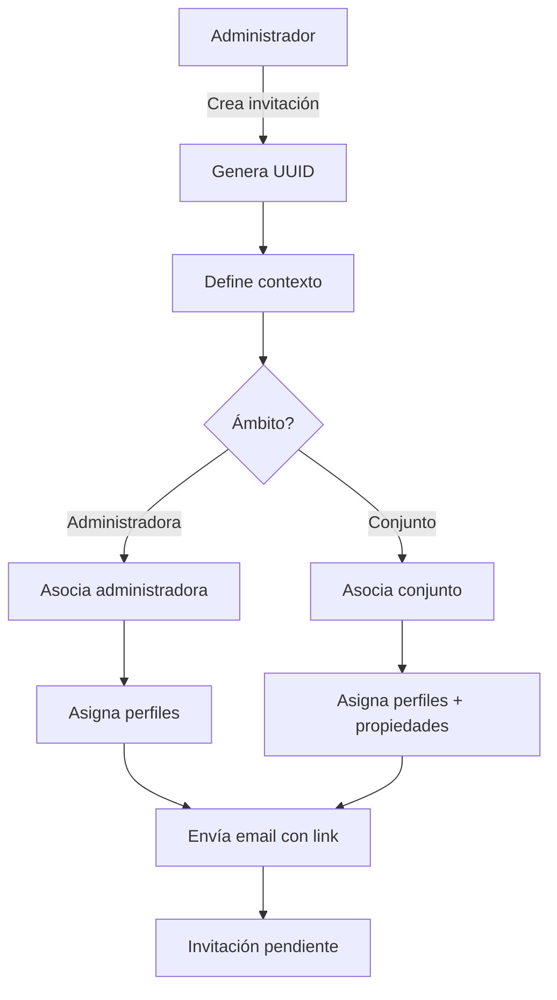
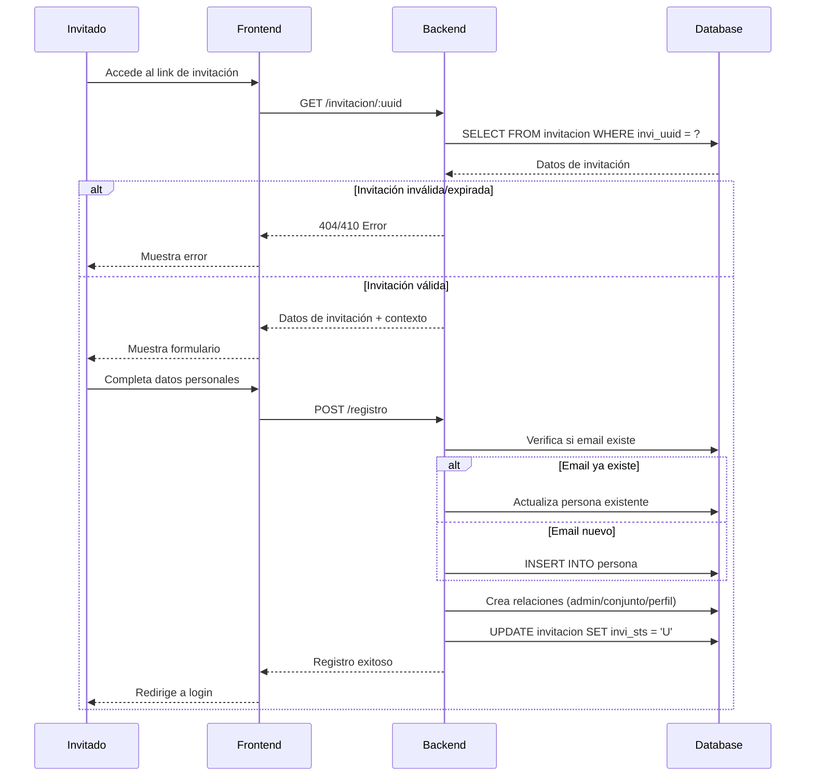
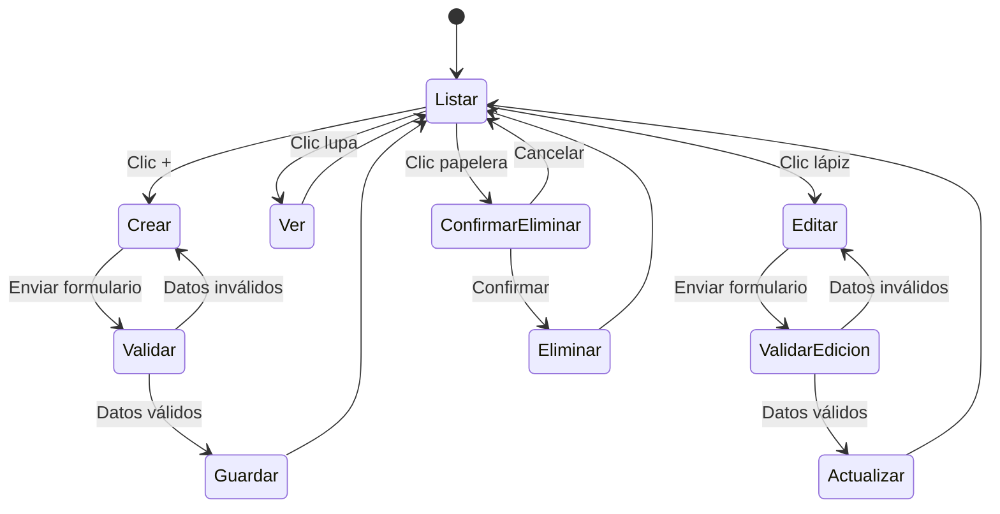
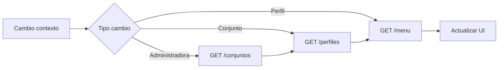
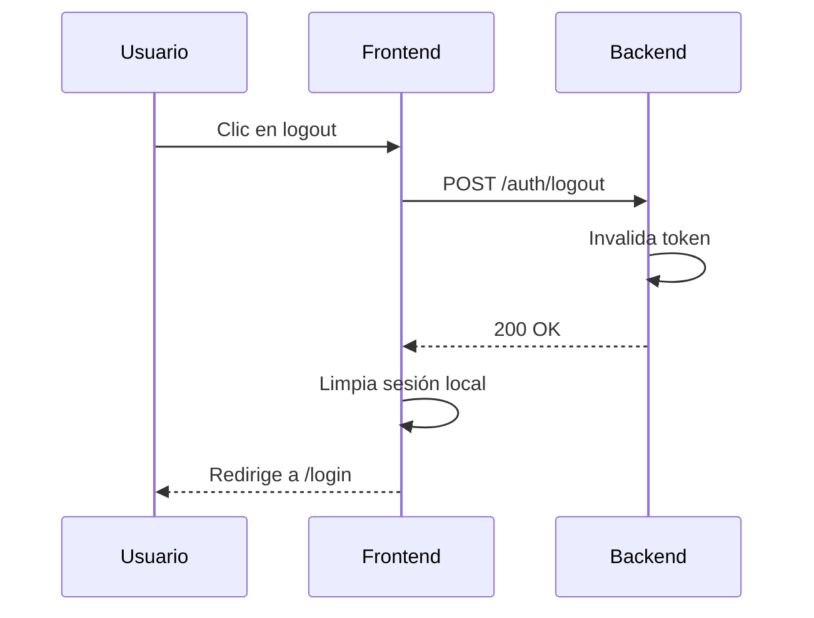

# Flujos de Proceso

## 1. Invitación al Sistema

El sistema NO permite auto-registro. Todos los usuarios deben ser invitados.

### Diagrama del Flujo



### Datos de Invitación

```sql
INSERT INTO invitacion (
    invi_uuid,
    invi_email,
    invi_fch_hor_crea,
    invi_fch_vencimiento,
    invi_sts,
    invi_per_id_crea
) VALUES (
    gen_random_uuid(),           -- UUID único
    'nuevo@usuario.com',         -- Email del invitado
    NOW(),                       -- Fecha actual
    NOW() + INTERVAL '7 days',   -- Vence en 7 días
    'A',                         -- Activa
    123                          -- ID del administrador que invita
);
```

### Tipos de Invitación

#### Invitación de Administradora

Para usuarios que gestionarán una administradora:

```sql
-- Crear relación con administradora
INSERT INTO invi_administradora (ia_invi_id, ia_adm_id)
VALUES (:invi_id, :adm_id);

-- Asignar perfiles
INSERT INTO perf_invi_administradora (pia_invi_id, pia_prf_id)
VALUES (:invi_id, :perfil_id);

-- Asignar conjuntos opcionales
INSERT INTO conj_invi_administradora (cia_invi_id, cia_conj_id)
VALUES (:invi_id, :conj_id);
```

#### Invitación de Conjunto

Para propietarios o empleados de un conjunto:

```sql
-- Crear relación con conjunto
INSERT INTO invi_conjunto (ic_invi_id, ic_conj_id)
VALUES (:invi_id, :conj_id);

-- Asignar perfiles
INSERT INTO perf_invi_conjunto (pic_invi_id, pic_prf_id)
VALUES (:invi_id, :perfil_id);

-- Asignar propiedades (para propietarios)
INSERT INTO ppd_invi_conjunto (ppic_invi_id, ppic_prop_id)
VALUES (:invi_id, :prop_id);
```

### Estructura del Enlace

```
https://resimanager.com/invitacion/<UUID>

Ejemplo:
https://resimanager.com/invitacion/550e8400-e29b-41d4-a716-446655440000
```

## 2. Proceso de Registro

### Diagrama del Flujo



### Validaciones

| Campo | Validación |
|-------|------------|
| UUID | Debe existir y estar activo |
| Fecha vencimiento | Debe ser >= fecha actual |
| Estatus | Debe ser 'A' (Activa) |
| Email | Formato válido |

### Formulario de Registro

Campos requeridos:

```
- per_documento (Cédula/RIF)
- per_tipo_doc (V/E/J/P)
- per_nombre
- per_apellido
- per_usuario (debe ser único)
- per_clave
- per_telefono
- per_email (pre-cargado desde invitación)
```

### Creación de Relaciones

```sql
-- Si es invitación de Administradora
INSERT INTO pers_administradora (pa_per_id, pa_adm_id, pa_sts)
VALUES (:nuevo_per_id, :adm_id, 'A');

INSERT INTO perf_pers_administradora (ppa_per_id, ppa_adm_id, ppa_prf_id, ppa_sts)
VALUES (:nuevo_per_id, :adm_id, :perfil_id, 'A');

-- Si es invitación de Conjunto
INSERT INTO pers_conjunto (pc_per_id, pc_conj_id, pc_sts)
VALUES (:nuevo_per_id, :conj_id, 'A');

INSERT INTO perf_pers_conjunto (ppc_per_id, ppc_conj_id, ppc_prf_id, ppc_sts)
VALUES (:nuevo_per_id, :conj_id, :perfil_id, 'A');

-- Si se asignaron propiedades
INSERT INTO propietario_propiedad (pp_per_id, pp_prop_id, pp_tipo, pp_sts)
VALUES (:nuevo_per_id, :prop_id, 'P', 'A');
```

## 3. Mantenimiento de Invitaciones

### Proceso Automático de Limpieza

Se ejecuta en cada acceso a las opciones de invitaciones:

```sql
-- 1. Marcar como vencidas las invitaciones expiradas
UPDATE public.invitacion
SET invi_sts = 'V'
WHERE invi_sts = 'A'
  AND invi_fch_vencimiento < NOW();
```

### Política de Eliminación

Las invitaciones se eliminan cuando: `InviFchVencimiento + (InviFchVencimiento - InviFchHorCrea) < NOW()`

Es decir, el **doble del tiempo de vigencia** original.

```sql
-- Fórmula: Si vencía en 7 días, se elimina después de 14 días de creado

-- 2. Eliminar datos relacionados de ámbito Administradora
DELETE FROM public.perf_invi_administradora
USING (SELECT invi_id FROM public.invitacion
    WHERE ((invi_fch_vencimiento + (invi_fch_vencimiento - invi_fch_hor_crea)) < NOW())
    AND invi_sts = 'V'
) sq1
WHERE pia_invi_id = sq1.invi_id;

DELETE FROM public.conj_invi_administradora
USING (SELECT invi_id FROM public.invitacion 
    WHERE ((invi_fch_vencimiento + (invi_fch_vencimiento - invi_fch_hor_crea)) < NOW())
    AND invi_sts = 'V'
) sq1
WHERE cia_invi_id = sq1.invi_id;

DELETE FROM public.invi_administradora
USING (SELECT invi_id FROM public.invitacion 
    WHERE ((invi_fch_vencimiento + (invi_fch_vencimiento - invi_fch_hor_crea)) < NOW())
    AND invi_sts = 'V'
) sq1
WHERE ia_invi_id = sq1.invi_id;

-- 3. Eliminar datos relacionados de ámbito Conjunto
DELETE FROM public.perf_invi_conjunto
USING (SELECT invi_id FROM public.invitacion
    WHERE ((invi_fch_vencimiento + (invi_fch_vencimiento - invi_fch_hor_crea)) < NOW())
    AND invi_sts = 'V'
) sq1
WHERE pic_invi_id = sq1.invi_id;

DELETE FROM public.ppd_invi_conjunto
USING (SELECT invi_id FROM public.invitacion
    WHERE ((invi_fch_vencimiento + (invi_fch_vencimiento - invi_fch_hor_crea)) < NOW())
    AND invi_sts = 'V'
) sq1
WHERE ppic_invi_id = sq1.invi_id;

DELETE FROM public.invi_conjunto
USING (SELECT invi_id FROM public.invitacion
    WHERE ((invi_fch_vencimiento + (invi_fch_vencimiento - invi_fch_hor_crea)) < NOW())
    AND invi_sts = 'V'
) sq1
WHERE ic_invi_id = sq1.invi_id;

-- 4. Finalmente eliminar la invitación
DELETE FROM public.invitacion
WHERE ((invi_fch_vencimiento + (invi_fch_vencimiento - invi_fch_hor_crea)) < NOW())
  AND invi_sts = 'V';
```

### Estados de Invitación

| Estado | Código | Descripción |
|--------|--------|-------------|
| Activa | `A` | Pendiente de uso, dentro de vigencia |
| Vencida | `V` | Fuera de vigencia |
| Usada | `U` | Ya fue utilizada para registro |

## 4. Gestión de Entidades

### Flujo CRUD Estándar



### Acciones por Perfil

| Acción | Ícono | Permiso |
|--------|-------|---------|
| Crear | `+` | INS o MNJ |
| Ver | Lupa | VIS o MNJ |
| Editar | Lápiz | MOD o MNJ |
| Eliminar | Papelera | EL o MNJ |

### Validación de Permisos

Antes de cada operación:

```javascript
// Verificar permiso en frontend
const puedeCrear = permisos.includes('INS') || permisos.includes('MNJ');
const puedeEditar = permisos.includes('MOD') || permisos.includes('MNJ');
const puedeEliminar = permisos.includes('EL') || permisos.includes('MNJ');
const puedeVer = permisos.includes('VIS') || permisos.includes('MNJ');
```

## 5. Flujo de Cambio de Contexto

### Escenarios

1. **Cambio de Administradora**
   - Recarga conjuntos disponibles
   - Recarga perfiles disponibles
   - Recarga menú

2. **Cambio de Conjunto**
   - Mantiene administradora
   - Recarga perfiles disponibles
   - Recarga menú

3. **Cambio de Perfil**
   - Solo recarga menú

### Diagrama



## 6. Proceso de Logout



## 7. Recuperación de Contraseña

> TODO: Definir flujo de recuperación

Consideraciones:
- Email de verificación
- Token temporal con expiración corta
- Validación de nueva contraseña
- Notificación de cambio
